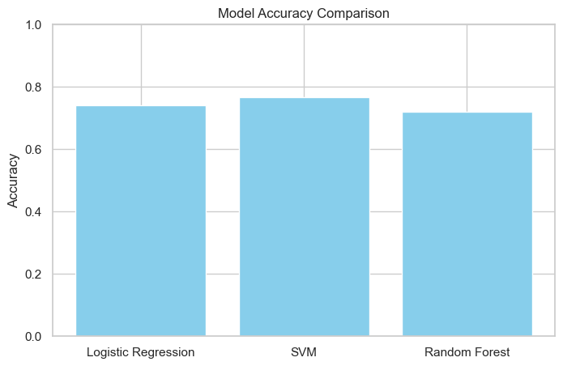
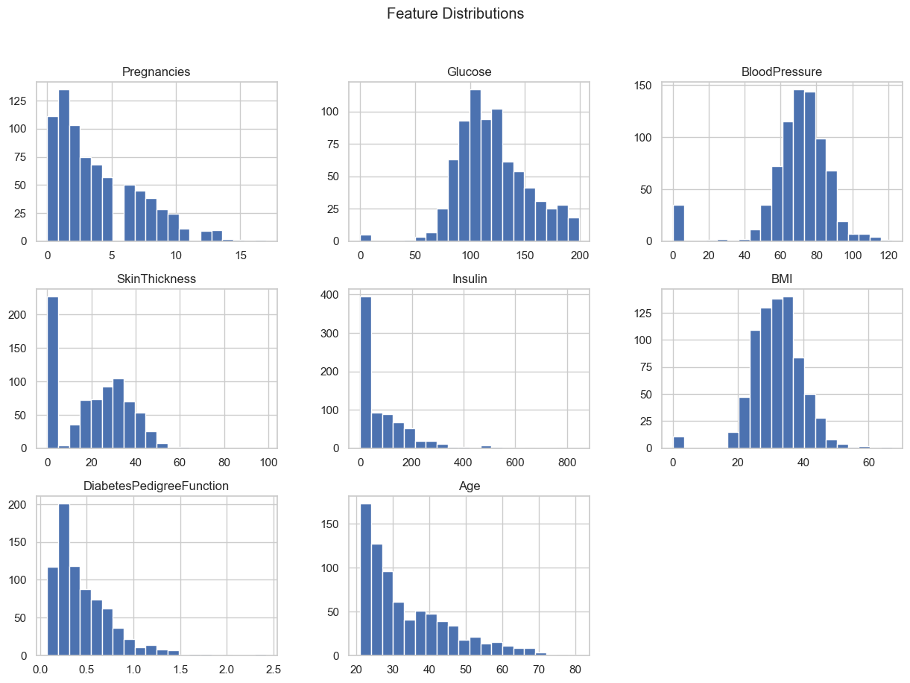
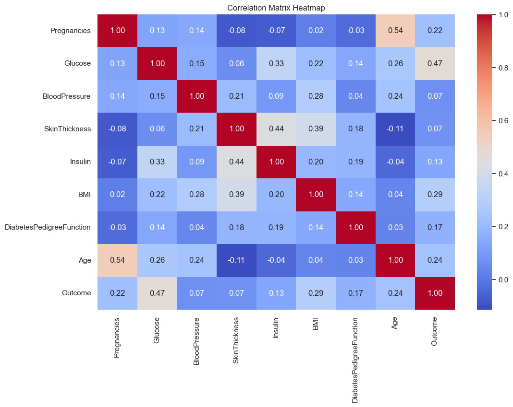

# Diabetes Prediction Using Machine Learning


**Author:** Charalampos Zisis

---

## Overview

Binary classification project predicting whether a patient has diabetes based on diagnostic medical measurements. Three classifiers are trained, evaluated, and compared on the **Pima Indians Diabetes Dataset** (768 patients, 8 clinical features).

---

## Dataset

- **Source:** [Pima Indians Diabetes Database – Kaggle](https://www.kaggle.com/datasets/uciml/pima-indians-diabetes-database)
- **Observations:** 768 female patients (age ≥ 21)
- **Target:** Binary — `1` = Diabetes, `0` = No diabetes

| Feature | Description |
|---|---|
| Pregnancies | Number of times pregnant |
| Glucose | Plasma glucose concentration |
| BloodPressure | Diastolic blood pressure (mm Hg) |
| SkinThickness | Triceps skin fold thickness (mm) |
| Insulin | 2-hour serum insulin (μU/ml) |
| BMI | Body mass index |
| DiabetesPedigreeFunction | Genetic diabetes risk score |
| Age | Age in years |

---

## Methodology

1. **Data Preprocessing** — Zero-value imputation for physiologically impossible entries, feature scaling with `StandardScaler`, 80/20 train-test split.
2. **Exploratory Data Analysis** — Distribution plots, correlation matrix, pairplot by outcome class.
3. **Model Training** — Logistic Regression, Support Vector Machine (RBF kernel), Random Forest Classifier.
4. **Evaluation** — Accuracy, Confusion Matrix, Precision/Recall/F1.

---

## Results

| Model | Accuracy |
|---|:---:|
| **SVM (RBF kernel)** | **76.6%** |
| Logistic Regression | 74.6% |
| Random Forest | 72.0% |

SVM achieved the best accuracy and was selected as the final model.

### Model Accuracy Comparison


---

## Exploratory Data Analysis

### Feature Distributions


### Correlation Matrix


> **Key insight:** Glucose is the strongest predictor of diabetes outcome (r = 0.47), followed by BMI (r = 0.29) and Age (r = 0.24).

---

## Project Structure

```
├── diabetes project.ipynb    # Full analysis notebook
├── figures/                  # EDA and results plots
├── requirements.txt          # Python dependencies
└── README.md
```

---

## How to Run

```bash
# Install dependencies
pip install -r requirements.txt

# Open the notebook
jupyter notebook "diabetes project.ipynb"
```

---

## Stack

`Python` `Scikit-learn` `Pandas` `NumPy` `Matplotlib` `Seaborn`  
Dataset: Pima Indians Diabetes Database (UCI / Kaggle)
